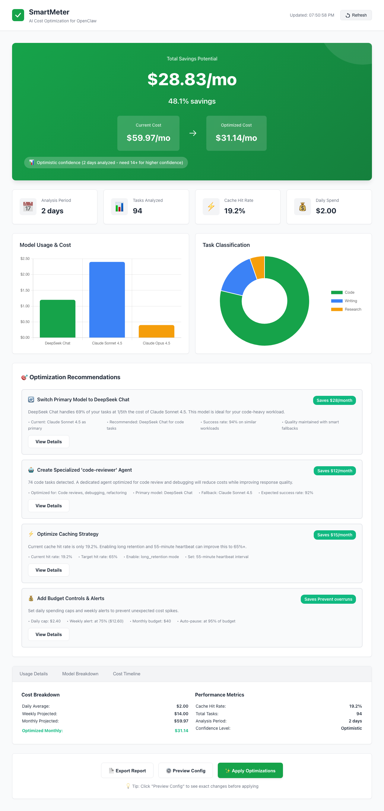
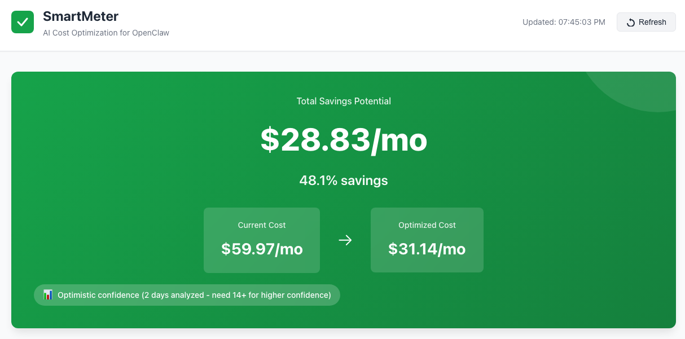
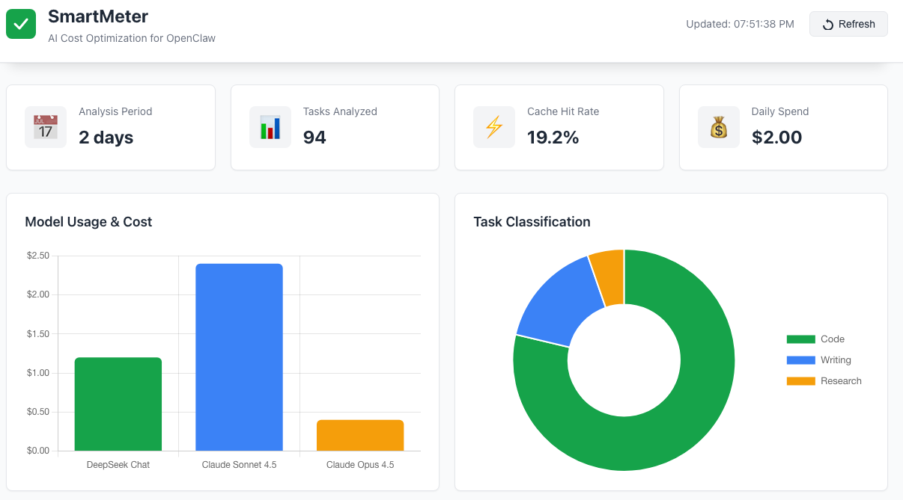

<p align="center">
  <h1 align="center">SmartMeter</h1>
  <p align="center">
    <strong>AI cost optimization for OpenClaw</strong>
  </p>
  <p align="center">
    Analyze your AI usage patterns. Generate optimized configs. Cut costs by 48%+.
  </p>
  <p align="center">
    <a href="LICENSE"></a>
    <a href="#"></a>
    <a href="#"></a>
  </p>
</p>

---

## What is SmartMeter?

SmartMeter is a cost optimization skill for [OpenClaw](https://openclaw.ai) that analyzes your AI agent usage and generates optimized configurations to reduce API spending — without sacrificing quality.

It parses your session logs, classifies tasks by type, identifies which models are overkill for routine work, and generates a tuned `openclaw.json` that routes the right tasks to the right models.

### Real-World Results

Tested on live OpenClaw data (288 tasks across 9 sessions):

| Metric                       | Value                                               |
| ---------------------------- | --------------------------------------------------- |
| Current monthly projection   | $59.97                                              |
| Optimized monthly projection | $31.14                                              |
| **Potential savings**        | **$28.82/month (48.1%)**                            |
| Models analyzed              | DeepSeek Chat, Claude Sonnet 4.5, Claude Opus 4.5   |
| Confidence                   | Optimistic (2 days of data; improves with 14+ days) |

The key insight: DeepSeek Chat handled 69% of tasks at 1/5th the cost of premium models, while Opus was only needed for 15% of complex work.

## Features

- **Usage Analysis** — Parse JSONL session logs, extract model usage, token counts, costs, and cache performance across all agents
- **Task Classification** — Automatically categorize tasks into code, writing, research, config, and other using keyword-based classification
- **Cost Optimization** — Identify where expensive models are being used for simple tasks and recommend cheaper alternatives
- **Config Generation** — Generate production-ready `openclaw.json` with primary model, fallback chains, specialized agents, budget controls, and caching settings
- **Live Dashboard** — Interactive web dashboard deployed to OpenClaw Canvas with auto-refresh, charts, and actionable recommendations
- **Safe Rollback** — Every config change creates a timestamped backup; one command to roll back
- **CLI Interface** — 8 commands covering the full workflow from analysis to deployment

## Installation

```bash
git clone https://github.com/vajih/openclaw-smartmeter.git
cd openclaw-smartmeter
npm install
```

To make the `smartmeter` command available globally:

```bash
npm link
```

## Quick Start

### Super Simple - One Command! 🚀

```bash
# Install globally
npm install -g openclaw-smartmeter

# Run analysis - dashboard opens automatically in your browser!
smartmeter analyze
```

That's it! The dashboard opens automatically with:

- ✅ Cost savings visualization
- ✅ One-click optimization application
- ✅ Export reports
- ✅ Live data updates

### Detailed Workflow

### 1. Analyze your usage (auto-opens dashboard)

```bash
# Analyze default OpenClaw data (~/.openclaw)
smartmeter analyze

# Or point to a specific data directory
smartmeter analyze --data-dir ~/my-openclaw-data
```

Output:

```
Analysis: 2026-02-04 to 2026-02-05 (2 days)

  Total tasks               288
  Total cost                $4.00
  Monthly cost (projected)  $59.97
  Optimized monthly cost    $31.14
  Potential savings         $28.82/month (48.1%)
  Confidence                optimistic
```

### 2. Use the Dashboard (already open!)

The dashboard automatically opened in step 1, showing:

- Cost savings overview with before/after comparison
- Model usage breakdown (bar chart)
- Task classification distribution (doughnut chart)
- Actionable recommendations with impact estimates
- Auto-refresh every 5 seconds

**Dashboard Actions:**

- 🎯 **Apply Optimizations** - One click to apply all changes (creates backup)
- 📄 **Export Report** - Download markdown report
- ⚙️ **Preview Config** - See exact changes before applying

### 3. Evaluate your configuration

```bash
smartmeter evaluate
```

Output shows:

- Current vs optimized costs
- Potential savings
- Cache performance
- Top recommendations
- Next steps

### 3. Get optimization guidance

```bash
smartmeter guide
```

Interactive guide with:

- De5. Apply the optimized config

```bash
smartmeter apply --data-dir ~/my-openclaw-data
```

This creates a backup of your current config before writing the new one.

### 6. Launch the full-featured dashboard

```bash
smartmeter serve
```

Opens an interactive web dashboard with API server:

- **Apply optimizations** directly from the browser
- **Export reports** as markdown
- **Preview config changes** in a popup
- Cost savings overview with confidence indicators
- Model usage breakdown (bar chart)
- Task classification distribution (doughnut chart)
- Auto-refresh every 5 seconds

### 7sh

smartmeter show --data-dir ~/my-openclaw-data

````

### 4. Apply the optimized config

```bash
smartmeter apply --data-dir ~/my-openclaw-data
````

This creates a backup of your current config before writing the new one.

### 5. Launch the dashboard

```bash
smartmeter dashboard
```

Opens an interactive web dashboard in your browser with:

- Cost savings overview with confidence indicators
- Model usage breakdown (bar chart)
- Task classification distribution (doughnut chart)
- Actionable recommendations with impact estimates
- Auto-refresh every 5 seconds

### 6. Roll back if needed

```bash
smartmeter rollback
```

## CLI Reference

| Command                | Description                                               |
| ---------------------- | --------------------------------------------------------- |
| `smartmeter analyze`   | Run full analysis pipeline and save results               |
| `smartmeter evaluate`  | Evaluate current configuration and show savings potential |
| `smartmeter guide`     | Interactive guide for optimizing your configuration       |
| `smartmeter show`      | Display the generated optimized config as JSON            |
| `smartmeter preview`   | Show what would change without applying                   |
| `smartmeter apply`     | Apply optimized config (creates backup first)             |
| `smartmeter rollback`  | Restore the most recent backup config                     |
| `smartmeter status`    | Show current optimization status from stored analysis     |
| `smartmeter report`    | Detailed breakdown: models, categories, temporal, caching |
| `smartmeter dashboard` | Deploy and open the web dashboard (static only)           |
| `smartmeter serve`     | Start full-featured dashboard with API server             |

**Global options** for commands that run analysis:

- `-d, --data-dir <path>` — OpenClaw data directory (default: `~/.openclaw`)

**Dashboard options:**

- `-p, --port <number>` — Dashboard port (default: 8080)
- `--api-port <number>` — API server port (default: 3001, serve command only)
- `--no-open` — Don't open browser automatically

## Workflows

### CLI Workflow (Quick Analysis)

```bash
# 1. Analyze your usage
smartmeter analyze

# 2. Get a friendly evaluation
smartmeter evaluate

# 3. Get detailed guidance
smartmeter guide

# 4. Preview changes
smartmeter preview

# 5. Apply optimizations
smartmeter apply
```

### Dashboard Workflow (Full-Featured UI)

```bash
# Start dashboard + API server
smartmeter serve

# Opens browser to http://localhost:8080
# Dashboard features:
# - Live cost analytics
# - Click "Apply Optimizations" button
# - Export reports
# - Preview config changes
# All without leaving the browser!
```

## Screenshots

### Dashboard Overview


_Live-updating dashboard with cost savings, model breakdown, and actionable recommendations_

### Cost Savings Analysis


_Real-time savings calculation showing 48% cost reduction with confidence indicators_

### Interactive Analytics


_Model usage breakdown and task classification powered by Chart.js_

## How It Works

SmartMeter processes your data through a four-stage pipeline:

```
Session Logs (.jsonl)
        |
   [ Parser ]          Stream-parse JSONL, extract assistant messages,
        |               pair with user prompts, normalize content formats
        v
  [ Classifier ]        Keyword-based task categorization into
        |               code / write / research / config / other
        v
  [ Aggregator ]        Per-model and per-category statistics,
        |               temporal patterns, caching metrics
        v
  [ Recommender ]       Per-category model recommendations,
        |               savings calculations, confidence scoring
        v
  [ Config Generator ]  Optimized openclaw.json with model routing,
                        agents, budgets, caching, fallback chains
```

### What gets optimized

1. **Primary Model** — Switch to the cheapest model that handles your dominant workload
2. **Specialized Agents** — Auto-create agents for high-volume categories (e.g., a `code-reviewer` agent using DeepSeek for code tasks)
3. **Fallback Chains** — Ordered by cost so expensive models are only used when needed
4. **Budget Controls** — Daily/weekly caps with alert thresholds to prevent runaway costs
5. **Caching** — Long retention and heartbeat settings for burst usage patterns
6. **Skill Routing** — Ready for per-skill model assignment (awaiting skill log format)

### Important Notes on Cost Tracking

**Cost Data Source**: SmartMeter extracts cost information from your OpenClaw session files (`.jsonl`). If the dashboard shows $0.00 costs even though you have actual API usage:

- **Root Cause**: OpenRouter may not be including cost data in API responses, resulting in session files with `cost: {total: 0}`
- **Impact**: SmartMeter can still provide optimization recommendations based on token usage patterns, but cost calculations will be unavailable
- **Solution**: SmartMeter will detect this scenario and display professional messaging indicating that more usage data is needed or that cost tracking is limited

**Data Requirements**: For accurate cost analysis, SmartMeter needs:
- Minimum 5 tasks analyzed
- At least 1 day of usage data
- session files with non-zero cost values

When these conditions aren't met, the dashboard displays a helpful message instead of misleading $0.00 values.

## Architecture

```
src/
  analyzer/             # Phase 1: Analysis engine
    parser.js           #   JSONL stream parser with content normalization
    classifier.js       #   Keyword-based task classifier
    aggregator.js       #   Statistics aggregation
    recommender.js      #   Optimization recommendations
    storage.js          #   Analysis persistence
  generator/            # Phase 2: Config generator
    config-builder.js   #   Main orchestrator
    agent-creator.js    #   Specialized agent creation
    merger.js           #   Deep merge utility
    validator.js        #   Config validation
  canvas/               # Canvas dashboard
    deployer.js         #   Dashboard deployment and public data generation
  cli/                  # Phase 3: CLI interface
    index.js            #   Commander.js entry point (8 commands)
    commands.js         #   Command handlers
    utils.js            #   Formatting helpers
tests/                  # 93 tests across all modules
canvas-template/        # Dashboard HTML/JS/CSS
docs/                   # SPEC alignment, backlog, dashboard docs
```

## Testing

```bash
# Run all tests
npm test

# Run a specific test file
node --test tests/parser.test.js

# Run with verbose output
node --test --reporter spec tests/*.test.js
```

93 tests covering parser, classifier, aggregator, recommender, storage, config generator, and CLI commands.

## Documentation

- [SPEC.md](SPEC.md) — Full project specification (source of truth)
- [docs/SPEC_ALIGNMENT.md](docs/SPEC_ALIGNMENT.md) — Implementation status for each SPEC requirement
- [docs/backlog.md](docs/backlog.md) — Deferred features and future phases
- [docs/CANVAS_DASHBOARD.md](docs/CANVAS_DASHBOARD.md) — Dashboard quick start guide
- [docs/CANVAS_BUILD_NOTES.md](docs/CANVAS_BUILD_NOTES.md) — Dashboard build notes
- [CONTRIBUTING.md](CONTRIBUTING.md) — Contribution guidelines
- [SECURITY.md](SECURITY.md) — Security policy

## Roadmap

- [x] **Phase 1** — Analysis Engine (parser, classifier, aggregator, recommender)
- [x] **Phase 2** — Config Generator (model optimization, agents, budgets, caching)
- [x] **Phase 3** — CLI Interface (8 commands with `--data-dir` support)
- [x] **Canvas Dashboard** — Interactive web dashboard with charts and recommendations
- [ ] **Phase 4** — OpenRouter API integration for live pricing
- [ ] **Phase 5** — Telegram alerts and notifications
- [ ] **Phase 6** — Chrome extension for real-time monitoring

## Author

**Vajih Khan**

- LinkedIn: [linkedin.com/in/vajihkhan](https://www.linkedin.com/in/vajihkhan/)
- Twitter: [@vajih](https://twitter.com/vajih)
- GitHub: [@vajih](https://github.com/vajih)

Built with 30+ years of experience in technology innovation, product development, and AI optimization.

## License

[Apache License 2.0](LICENSE)

---

Built with [OpenClaw](https://openclaw.ai) and [Claude Code](https://claude.ai/claude-code)
